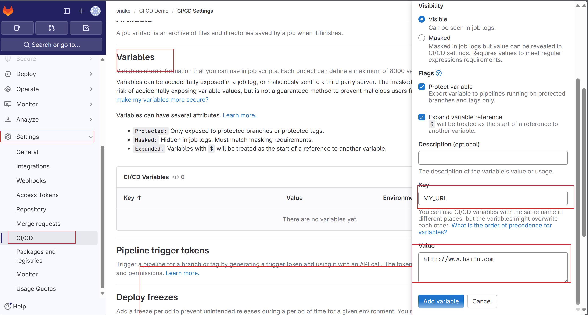

# GitLabCICD 入门
[很好的课程](https://www.youtube.com/watch?v=-4XT8-znkuc&list=PLBd8JGCAcUAEwyH2kT1wW2BUmcSPQzGcu)
1. 编写 .gitlab-ci.yml 文件
    - 创建项目后在项目中有.gitlab-ci.yml提交到gitlab后会自动跑流水线
2. .gitlab-ci.yml 文件案例
   ```yaml
   # 自定义的job名称
   helloworld:
   # 执行的脚本命令
      script:
         - echo "hello world,gitlab"
   run_test:
      script:
         - echo "执行单元测试3"
   # 看名字就知道
      before_script:
         - echo "1"
         - echo "2"
   # 看名字就知道
      after_script:
         - echo "4"
   bad_test:
      script:
         - yfd
   ```
3. 工作阶段以及依赖性
    - stages 代表阶段如果testing失败了那么deploy也就不执行了
    - 我们看到testing阶段下有2个任务，如果想做到更精确的流程控制增加了needs关键字
    ```yaml
        stages:
          - linter
          - testing
          - build
          - deploy
    
        helloworld:
          stage: linter
          script:
            - echo "hello world,gitlab"
        run_test:
          stage: testing
          needs: bad_test
          script:
            - echo "执行单元测试3"
        bad_test:
          stage: testing
          script:
            - yfd
        deploy_dowm:
          stage: deploy
          script:
            - echo "部署完成"
    ```
4. 执行外部脚本
    - 执行 ./run.sh脚本
    - chmod +x ./run.sh
   ```shell
      echo "外部文件执行"
      ls -al
       echo "外部文件执行end"  
   ```
   ```yaml
     stages:
        - linter
        - testing
        - build
        - deploy
   
     helloworld:
        stage: linter
        script:
           - echo "hello world,gitlab"
           - chmod +x ./run.sh
           - ./run.sh
     run_test:
        stage: testing
        needs:
           - bad_test
        script:
           - echo "执行单元测试3"
     bad_test:
        stage: testing
        script:
           - yfd
     deploy_dowm:
        stage: deploy
        script:
           - echo "部署完成"        
   ```
5. 指定分支
    - only except 关键字
   ```yaml
      stages:
          - linter
          - testing
          - build
          - deploy
      
      helloworld:
          stage: linter
          script:
              - echo "hello world,gitlab"
              - chmod +x ./run.sh
              - ./run.sh
      run_test:
          stage: testing
          script:
              - echo "执行单元测试3"
      
      build_docker_image:
          stage: build
          only:
              - mian
          script: 
              - echo "构建docker镜像"
      deploy_dowm:
          stage: deploy
          only:
              - main
          script:
              - echo "部署完成"
   ```
6. 环境变量
    - 在yml中配置环境变量
    - 还可以在gitlab页面中配置
    - gitlab 中有很多已经定义好的变量 CI_COMMIT_BRANCH
      CI_PIPELINE_SOURCE [预定义的环境变量](https://docs.gitlab.cn/jh/ci/variables/predefined_variables.html)

```yaml
stages:
  - linter
  - testing
  - build
  - deploy
# 全局变量
variables:
  MY_URL: "全局变量"
helloworld:
  # 局部变量只能在当前job下使用
  variables:
    MY_NAME: "YFD"
  stage: linter
  script:
    - echo "hello world,$MY_NAME"
```

7.使用 workflow: 来确定是否创建流水线

```yaml
workflow:
  rules:
    - if: $CI_COMMIT_BRANCH == "dev"
    - when: never
    - if: $CI_COMMIT_BRANCH == $CI_DEFAULT_BRANCH
    - when: always
```
   
   