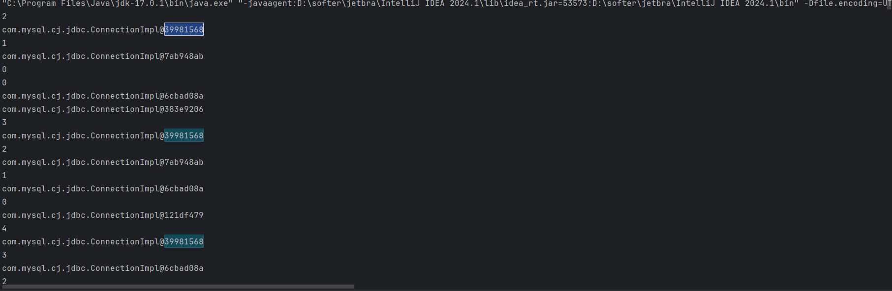

# 简单实现jdbc工具类的封装
1. 引入mysql的依赖
```xml

<dependency>
    <groupId>mysql</groupId>
    <artifactId>mysql-connector-java</artifactId>
    <version>8.0.28</version>
</dependency>
```
2. 封装Jdbc的工具类，获取连接，释放资源
```java
public class JdbcUtil {
    //1.数据库连接信息
    public static String url = "jdbc:mysql://127.0.0.1:3306/spring_boot";
    public static String user = "root";
    public static String password = "123456";
    //2.通过反射加载驱动获取驱动类
    static {
        try {
            Class.forName("com.mysql.cj.jdbc.Driver");
        } catch (ClassNotFoundException e) {
            throw new RuntimeException(e);
        }


    }
    //3.获取连接
    public static Connection getConnection() throws SQLException {
        return DriverManager.getConnection(url, user, password);
    }
    //4.释放资源
    public static void close(Connection conn, Statement stmt, ResultSet rs) throws SQLException {
        if (rs != null) {
            try {
                rs.close();
            } catch (SQLException e) {
                throw new RuntimeException(e);
            }finally {
                if (stmt != null) {
                    try {
                        stmt.close();
                    } catch (SQLException e) {
                        throw new RuntimeException(e);
                    }finally {
                        if (conn != null){
                            conn.close();
                        }
                    }
                }
            }
        }
    }
}
```
3. 测试
```java
  public static void main(String[] args) {
        Connection connection = null;
        Statement statement = null;
        try {
            connection = JdbcTestUtil.getConnection();
            statement = connection.createStatement();
            statement.executeUpdate("insert into user(name,age) values('zhangsan', 1)");
        } catch (SQLException e) {
            throw new RuntimeException(e);
        } finally {
            JdbcTestUtil.free(connection,statement,null);
        }
    }
```
---
# 简单实现数据库连接池
- 数据库的连接是一种网操作，会耗费时间，所以我们建立一个数据库连接池，使我们的连接可以重复的使用
1. 连接池
```java
public class MyDataSource {
    //1.数据库连接信息
    private static String url = "jdbc:mysql://127.0.0.1:3306/spring_boot";
    private static String user = "root";
    private static String password = "123456";

    //2. 创建连接
    public static Connection creatConnection() {
        try {
            return DriverManager.getConnection(url, user, password);
        } catch (SQLException e) {
            throw new RuntimeException(e);
        }
    }

    //3.定义连接池的大小
    private static final Integer min = 2;
    private static final Integer max = 3;
    public static LinkedList<Connection> connectionList = new LinkedList<>();

    //4. 构造器创建初始池的大小2
    public MyDataSource() {
        for (int i = 0; i < min; i++) {
            connectionList.add(creatConnection());
        }
    }

    //5.获取连接
    public static Connection getConnection() {
        synchronized (connectionList) {
            System.out.println(connectionList.size());

            if (connectionList.size() > 0) {
                try {
                    Connection remove = connectionList.remove();
                    return remove;
                } catch (NoSuchElementException e) {
                    if (connectionList.size() < max) {
                        return creatConnection();
                    }
                }
            }
            if (connectionList.size() < max) {
                return creatConnection();
            }
            throw new RuntimeException("caocaocooaocoaoc");
        }
    }

    //6.释放的连接加入到连接池
    public static void free(Connection connection) {
        connectionList.add(connection);
    }
}
```
2. 定义数据库模板
```java
public class TempleTest {
    private static MyDataSource myDataSource;
    static {
        try {
            Class.forName("com.mysql.cj.jdbc.Driver");
            myDataSource = new MyDataSource();
        } catch (ClassNotFoundException e) {
            throw new RuntimeException(e);
        }
    }


    public static Connection getConnection() throws SQLException {
        return myDataSource.getConnection();
    }

    public static void free(Connection con, Statement st, ResultSet rs) {
        try {
            if (rs != null)
                rs.close();
        } catch (SQLException e) {
            e.printStackTrace();
        } finally {
            try {
                if (st != null)
                    st.close();
            } catch (SQLException e) {
                e.printStackTrace();
            } finally {

                if (con != null)
                    myDataSource.free(con);
            }
        }
    }
}
```
3. 多线程测试
```java
 public static void main(String[] args) throws SQLException {
        ExecutorService executor = Executors.newFixedThreadPool(5);
        for (int i = 0; i < 10000; i++) {
            executor.submit(new Runnable() {
                @Override
                public void run() {
                    test();
                }
            });
        }
        executor.shutdown();
    }

    public static void test() {
        Connection connection = null;
        Statement statement = null;
        ResultSet resultSet = null;
        try {
            connection = TempleTest.getConnection();
            System.out.println(connection);
            statement = connection.createStatement();
            statement.executeQuery("select * from user where user_id = 22");

        } catch (Exception e) {
            System.out.println(e.getMessage());
//            throw new RuntimeException(e);
        } finally {
            TempleTest.free(connection, statement, resultSet);
        }
    }
```
