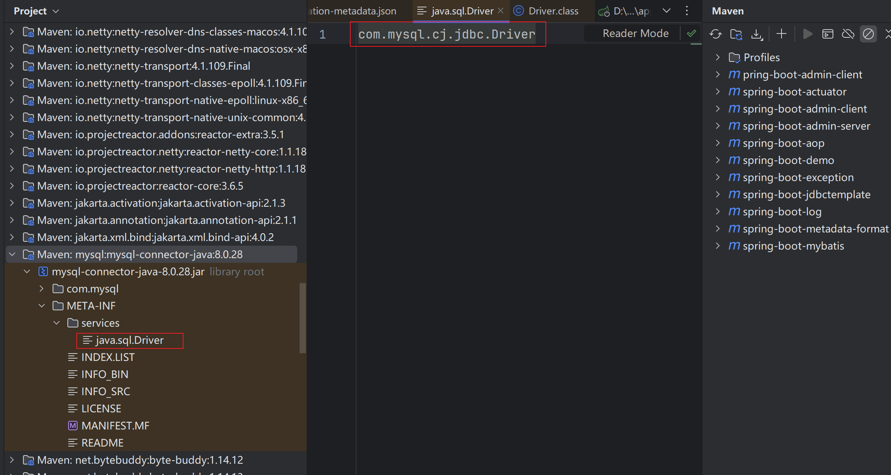

# spi 机制：
1. 在不修改原代码的基础上，通过pom依赖加载别的模块的配置到自己的服务中（个人理解）
2. java 可以连接不同的数据库，数据库的驱动各不相同，所以不同的数据库jar声名了这个文件java.sql.Driver，并定义各自的实现com.mysql.cj.jdbc.Driver

# 简单实现获取resource目录下配置文件信息

- 1. 首先创建配置文件(yfd.properties)
- 2. 纯java代码实现获取配置文件信息，并通过classLoader加载类并创建实体对象
```text
yfd=\
  com.yfd.spi.Yfd,\
  com.yfd.spi.Szl
```
```java
    public static void main(String[] args) throws ClassNotFoundException, IOException, NoSuchMethodException, InvocationTargetException, InstantiationException, IllegalAccessException {
    //1，读取properties文件信息,通过类加载器把配置文件读取到流，或者通过文件流读取
    Properties properties = new Properties();
    ClassLoader classLoader = ClassLoader.getSystemClassLoader();
    InputStream resourceAsStream = classLoader.getResourceAsStream("yfd.properties");
    properties.load(resourceAsStream);
    //2.根据配置文件的key获取值
    String yfd = properties.getProperty("yfd1");
    Class<?> aClass = classLoader.loadClass(yfd);
    Object o = aClass.getDeclaredConstructor().newInstance();
    if (o instanceof Yfd) {
        Yfd yfd1 = (Yfd) o;
        System.out.println(yfd1);
    }
}
```
# 升级版(依赖其他模块并且resource目录下的配置文件有用相同名称的属性)
1. a模块中有这样的yfd.properties
```text
yfd=\
  com.yfd.spi.Yfd,\
  com.yfd.spi.Szl
```
2. b模块中有这样的yfd.properties
```text
yfd=\
  com.yfd.spi.test.Main,\
  com.yfd.spi.test.YfdConfig,\
  com.yfd.spi.test.YfdUserConfig
```
3. a pom文件中依赖了b
4. 相对与基础版本
    - 实现了配置文件可能多个的读取
    - 避免了相同的属性的覆盖
```java
    /**
     * 增强版
     */
    public static void main(String[] args) throws IOException, ClassNotFoundException, NoSuchMethodException, InvocationTargetException, InstantiationException, IllegalAccessException {
        //1. 通过类加载器获取配置文件
        ClassLoader systemClassLoader = ClassLoader.getSystemClassLoader();
        Enumeration<URL> resources = systemClassLoader.getResources("yfd.properties");
        //2. 遍历配置文件
        while (resources.hasMoreElements()) {
            //3. 通过Properties 读取流
            Properties properties = new Properties();
            URL url = resources.nextElement();
            InputStream inputStream = url.openStream();
            properties.load(inputStream);
            //4. 获取当前读取的配置文件中所有的key
            Set<String> classKeys = properties.stringPropertyNames();
            for (String key : classKeys) {
                //5. key对象的vlaue是个字符串数组，如下面这种格式
                //  yfd=\
                //  com.yfd.spi.Yfd,\
                //  com.yfd.spi.Szl
                String value = properties.getProperty(key);
                String[] split = value.split(",");
                for (String itemClassName : split) {
                    //6. 通过类加载器创建对象
                    Class<?> aClass = systemClassLoader.loadClass(itemClassName);
                    Object o = aClass.getDeclaredConstructor().newInstance();
                    System.out.println(o);
                }
            }
            //7.关闭流
            inputStream.close();
        }
    }
```

# 把配置文件中的类加载到spring容器中

1. 把升级版的功能封装成一个类,返回一个Map<属性值, List<配置类全路径名>>
```java
public class FactoryLoad {
    public static Map<String, List<String>> classMap;
    public static List<Class<?>> classList;

    public static Class[] getFactoryClass(String className) throws IOException, ClassNotFoundException {
        if (classMap == null) {
            init();
        }
        classList = new ArrayList<>();
        //1.获取
        List<String> calssNameList = classMap.get(className);
        ClassLoader systemClassLoader = ClassLoader.getSystemClassLoader();
        for (String proterClassName : calssNameList) {
            Class<?> aClass = systemClassLoader.loadClass(proterClassName);
            classList.add(aClass);
        }
        return classList.toArray(Class[]::new);
    }

    public static void init() throws IOException {
        classMap = new HashMap<>();

        ClassLoader systemClassLoader = ClassLoader.getSystemClassLoader();
        Enumeration<URL> systemResources = systemClassLoader.getResources("yfd.properties");
        while (systemResources.hasMoreElements()) {
            Properties properties = new Properties();
            URL url = systemResources.nextElement();
            InputStream inputStream = url.openStream();
            properties.load(inputStream);
            Set<String> propertiesNames = properties.stringPropertyNames();
            for (String name : propertiesNames) {
                List<String> values = classMap.get(name);
                if (values == null) {
                    String value = properties.getProperty(name);
                    String[] split = value.split(",");
                    List<String> valueList = new ArrayList<>(Arrays.asList(split));
                    classMap.put(name, valueList);
                } else {
                    String value = properties.getProperty(name);
                    String[] split = value.split(",");
                    List<String> valueList = new ArrayList<>(Arrays.asList(split));
                    values.addAll(valueList);
                }
            }
            inputStream.close();
        }
    }
}
```
2. a和b模块中都引入spring的依赖
```xml
 <dependency>
            <groupId>org.springframework</groupId>
            <artifactId>spring-context</artifactId>
            <version>5.3.31</version>
</dependency>
```
3. 在b模块中写入一个配置类
```java
@Configuration
public class YfdConfig {
    @Autowired
    private YfdUserConfig userConfig;
    @Bean
    @Conditional({ConditionalMessingBean.class})
    public String test() {
        String name = userConfig.getName();
        return name;
    }
}

/**
 * 自定义一个条件注解
 */
public class ConditionalMessingBean implements Condition {
   @Override
   public boolean matches(ConditionContext context, AnnotatedTypeMetadata metadata) {
      Boolean test = context.getBeanFactory().containsBean("test");
      return !test;
   }
}
```
4. 在a服务中测试
```java
public static void main(String[] args) throws IOException, ClassNotFoundException, InstantiationException, IllegalAccessException {

   AnnotationConfigApplicationContext context = new AnnotationConfigApplicationContext();
   Class[] yfds = FactoryLoad.getFactoryClass("yfd");
   context.register(yfds);
   context.refresh();
   System.out.println(context.getBean("test"));
        
}
```
- 如果在a模块中添加test(bean) 则不会加载b模块的test(bean)
```java
@Configuration
public class Yfd {
    public Yfd(){
    }
    @Bean
    public String test() {
        return "test2";
    }
}
```


