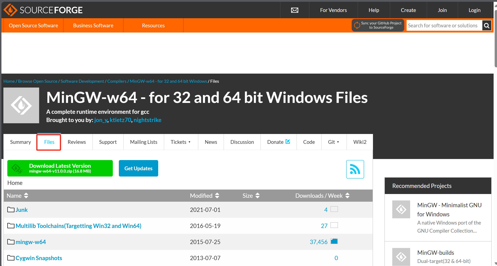
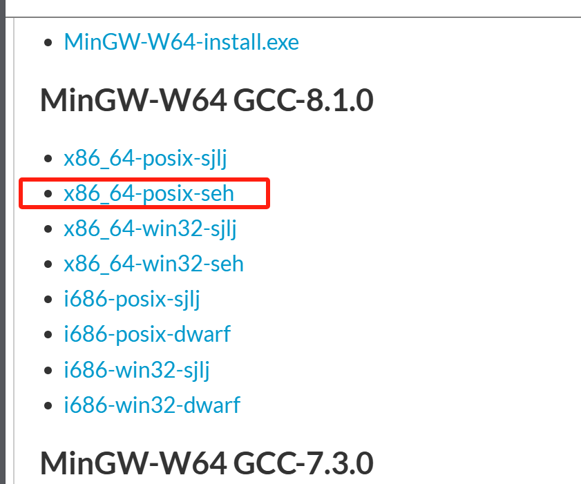
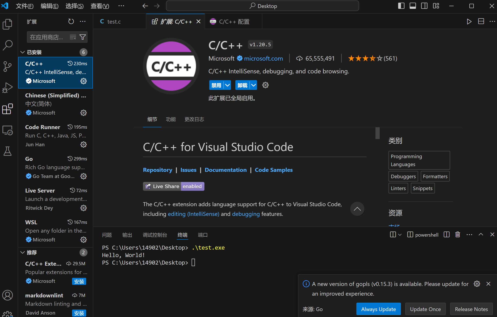
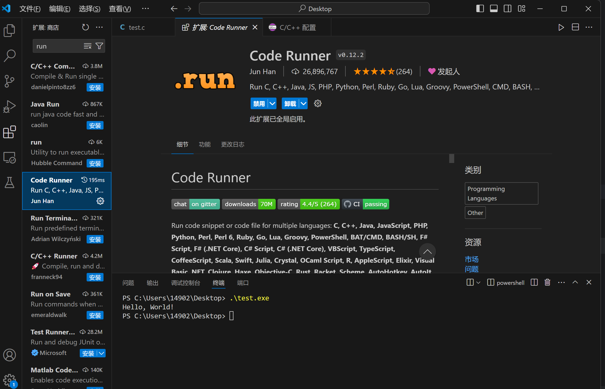
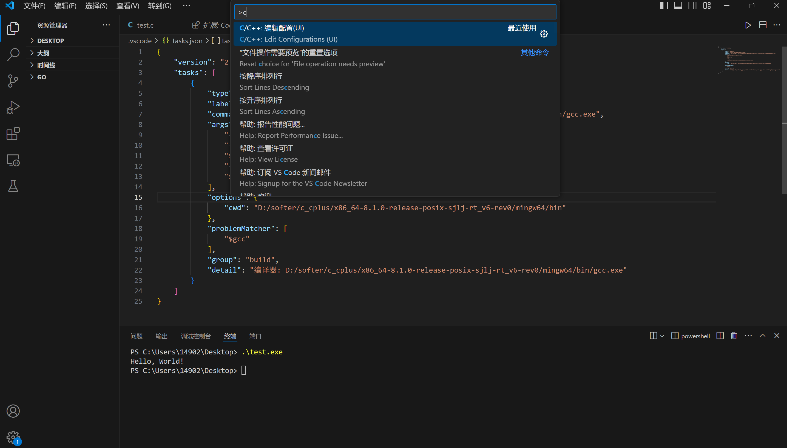
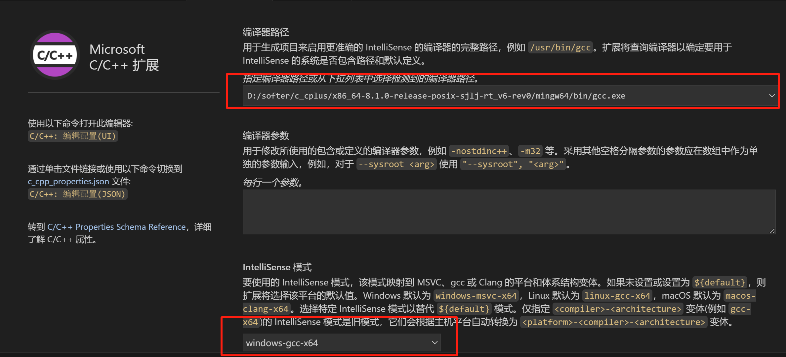

# 环境搭建
## gcc环境下载地址：
1. 下载
[mingw-w64](https://sourceforge.net/projects/mingw-w64/files/)


2. 配置环境变量 
将解压好的路径配置到path
```text
D:\softer\c_cplus\x86_64-8.1.0-release-posix-sjlj-rt_v6-rev0\mingw64\bin 
```   
3.vscode 安装插件

这个不装好像也没事
 
ctrl + shift +p  看到这个界面配置插件



#