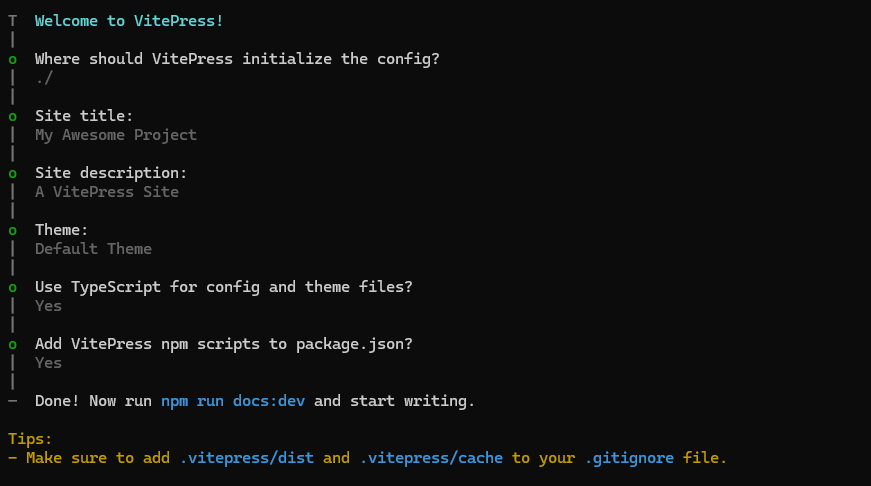
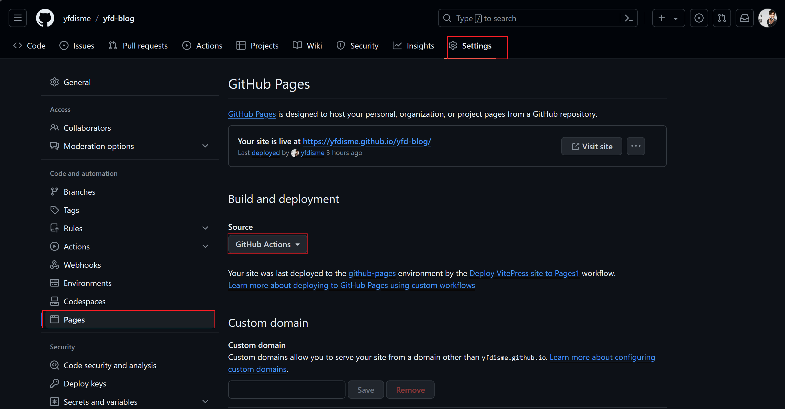

# 使用vitepress 搭建个人博客

使用vitepress搭建个人博客日记并部署到githubPages.

## vitepress项目下载
1. 官方地址: [vitepress](https://vitepress.dev/zh/)
2. 安装`npm add -D vitepress`
3. 安装向导`npx vitepress init`
<div align="center" style="text-align: center;">
    <a target="_blank">
        
    </a>
</div>

## githubPages 配置
1. github-pages配置
<div align="center" style="text-align: center;">
    <a target="_blank">
        
    </a>
</div>

2. 项目中流水线配置
```yaml
# 构建 VitePress 站点并将其部署到 GitHub Pages 的示例工作流程
name: Deploy VitePress site to Pages1

on:
  # 在针对 `main` 分支的推送上运行。如果你
  # 使用 `master` 分支作为默认分支，请将其更改为 `master`
  push:
    branches: [main]

  # 允许你从 Actions 选项卡手动运行此工作流程
  workflow_dispatch:

# 设置 GITHUB_TOKEN 的权限，以允许部署到 GitHub Pages
permissions:
  contents: read
  pages: write
  id-token: write

# 只允许同时进行一次部署，跳过正在运行和最新队列之间的运行队列
# 但是，不要取消正在进行的运行，因为我们希望允许这些生产部署完成
concurrency:
  group: pages
  cancel-in-progress: false

jobs:
  # 构建工作
  build:
    runs-on: ubuntu-latest
    steps:
      - name: Checkout
        uses: actions/checkout@v4
        with:
          fetch-depth: 0 # 如果未启用 lastUpdated，则不需要
      # - uses: pnpm/action-setup@v3 # 如果使用 pnpm，请取消注释
      # - uses: oven-sh/setup-bun@v1 # 如果使用 Bun，请取消注释
      - name: Setup Node
        uses: actions/setup-node@v4

      - name: Setup Pages
        uses: actions/configure-pages@v4

      - name: Install dependencies
        run: npm install # 或 pnpm install / yarn install / bun install

      - name: Build with VitePress
        run: npm run docs:build # 或 pnpm docs:build / yarn docs:build / bun run docs:build

      - name: Upload artifact
        uses: actions/upload-pages-artifact@v3
        with:
          path: .vitepress/dist

  # 部署工作
  deploy:
    environment:
      name: github-pages
      url: ${{ steps.deployment.outputs.page_url }}
    needs: build
    runs-on: ubuntu-latest
    name: Deploy
    steps:
      - name: Deploy to GitHub Pages
        id: deployment
        uses: actions/deploy-pages@v4
```

**Output**

```js{4}
export default {
  data () {
    return {
      msg: 'Highlighted!'
    }
  }
}
```

## Custom Containers

**Input**

```md
::: info
This is an info box.
:::

::: tip
This is a tip.
:::

::: warning
This is a warning.
:::

::: danger
This is a dangerous warning.
:::

::: details
This is a details block.
:::
```

**Output**

::: info
This is an info box.
:::

::: tip
This is a tip.
:::

::: warning
This is a warning.
:::

::: danger
This is a dangerous warning.
:::

::: details
This is a details block.
:::

## More

Check out the documentation for the [full list of markdown extensions](https://vitepress.dev/guide/markdown).
