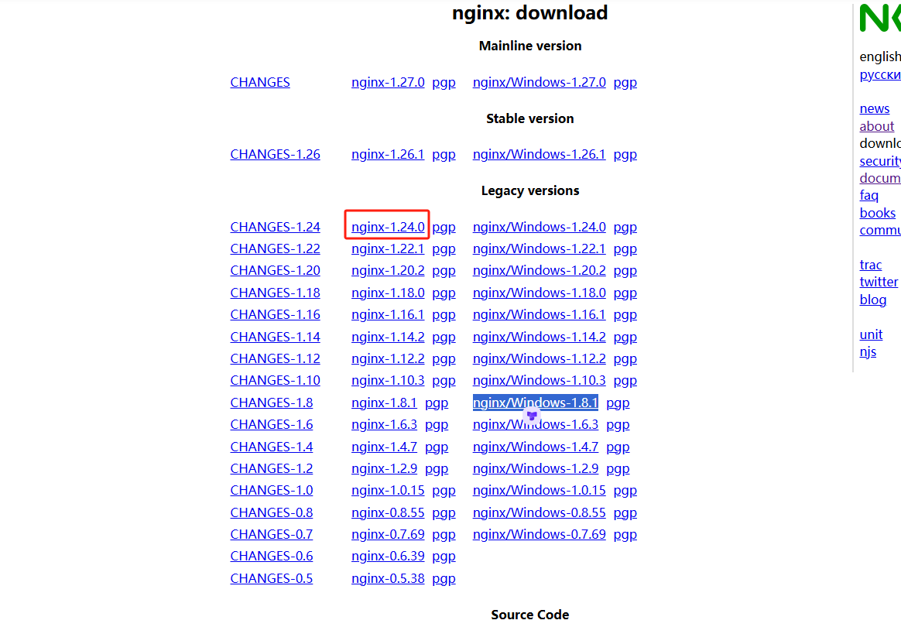
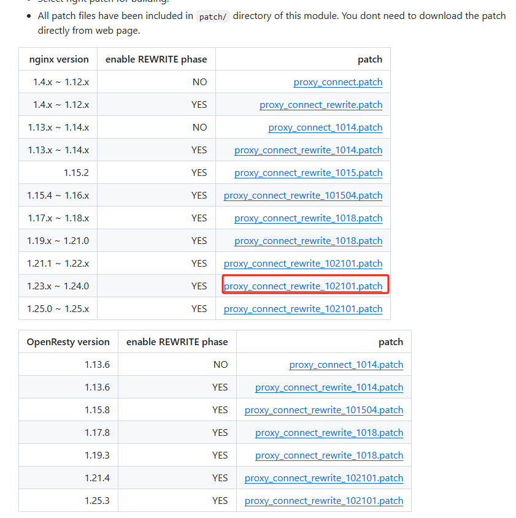
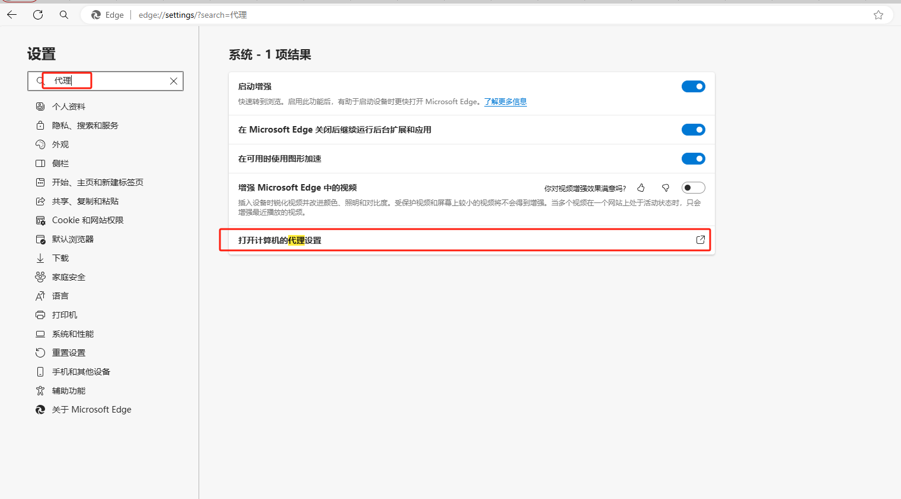
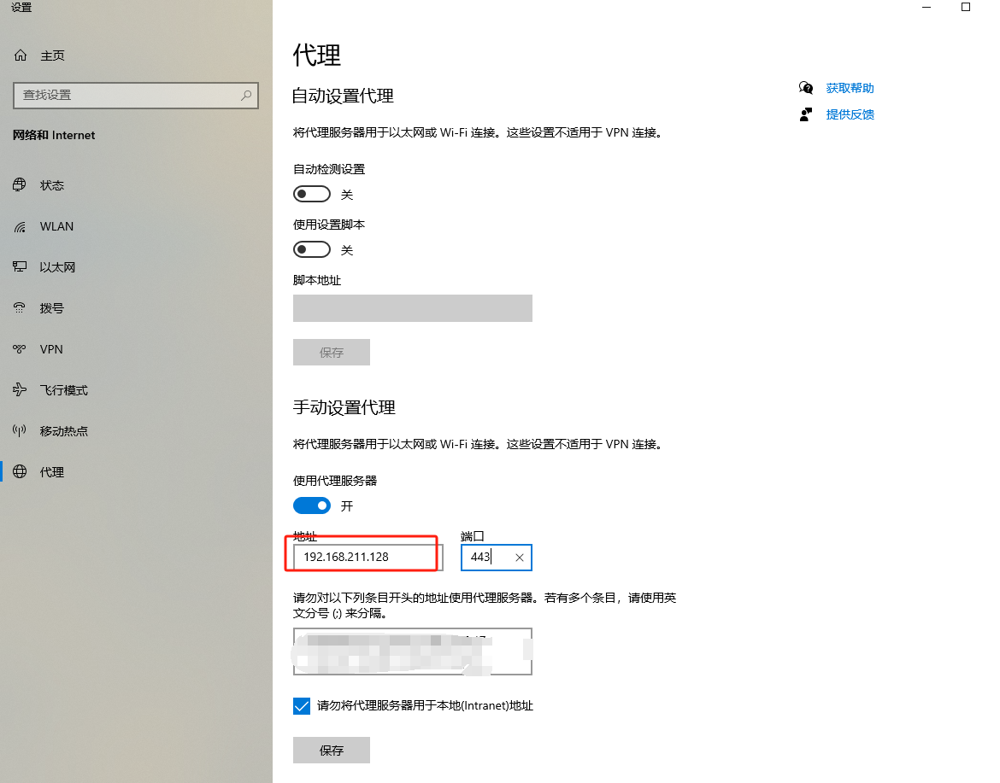
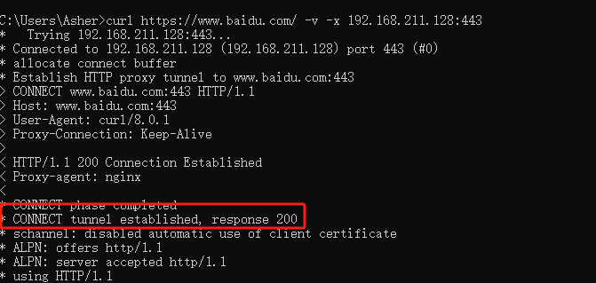

## centos7源码按装nginx

1. nginx下载

```text
https://nginx.org/en/download.html 
```



2. 解压

```text
tar -zxvf nginx-1.24.0.tar.gz
```

3. 安装依赖的环境

```text
cd nginx-1.24.0
./configure # 检查所需的安装环境
按照提示安装少的环境
# checking for C compiler ... not found
yum -y install gcc
# using --with-pcre=<path> option.
yum -y install pcre-devel
# using --with-zlib=<path> option.
yum -y install zlib-devel
# using --with-openssl=<path> option.
yum -y install openssl-devel

./configure --with-http_ssl_module --with-http_v2_module

```

4.编译安装

```text
看到如下信息安装成功
Configuration summary
+ using system PCRE library
+ using system OpenSSL library
+ using system zlib library

nginx path prefix: "/usr/local/nginx"
nginx binary file: "/usr/local/nginx/sbin/nginx"
nginx modules path: "/usr/local/nginx/modules"
nginx configuration prefix: "/usr/local/nginx/conf"
nginx configuration file: "/usr/local/nginx/conf/nginx.conf"
nginx pid file: "/usr/local/nginx/logs/nginx.pid"
nginx error log file: "/usr/local/nginx/logs/error.log"
nginx http access log file: "/usr/local/nginx/logs/access.log"
nginx http client request body temporary files: "client_body_temp"
nginx http proxy temporary files: "proxy_temp"
nginx http fastcgi temporary files: "fastcgi_temp"
nginx http uwsgi temporary files: "uwsgi_temp"
nginx http scgi temporary files: "scgi_temp"
```

继续执行编译安装

```text
make
make install
```

5. 启动服务

```text
 cd  /usr/local/nginx/sbin
 ./nginx
 ./nginx -s reload 重启
 ./nginx -s stop 停止
 #nginx配置文件路径按需修改
 /usr/local/nginx/conf/nginx.conf
```

## 正向代理

1. 什么是正向代理 例如本机不可上网，可以在能上网的目标上安装nginx 并将本计的请求代理到装有nginx的代理服务器，可以隐藏本计的ip
2. 实现nginx的正向代理 在实现nginx正向代理之前，先说明一下，现在的网站基本上都是https，因此要实现nginx正向代理转发请求，除了要配置转发http80端口的请求，还有配置https443端口的请求
    ```text
    下载补丁
     https://github.com/chobits/ngx_http_proxy_connect_module
    ```



3. 下载新模块

- GitHub上下载ngx_http_proxy_connect_module的zip压缩包源码：
  https://github.com/chobits/ngx_http_proxy_connect_module
- 将新模块ngx_http_proxy_connect_module源码压缩包上传到服务器/softer目录，并解压并重命名

```shell
 cd /softer
 unzip ngx_http_proxy_connect_module-master.zip
 mv ngx_http_proxy_connect_module-master ngx_http_proxy_connect_module
```

4. 添加模块到nginx

```shell
cd /softer/nginx-1.24.0
# 注意版本号对应的proxy_connect_rewrite_102101.patch 文件
patch -p1 < /softer/ngx_http_proxy_connect_module/patch/proxy_connect_rewrite_102101.patch
./configure --with-http_ssl_module --with-http_v2_module --add-module=/softer/ngx_http_proxy_connect_module
make
make install
```

5. 修改配置文件重启nginx . 
```shell
vi /usr/local/nginx/conf/nginx.conf
```
```shell
#user  nobody;
worker_processes  1;

#error_log  logs/error.log;
#error_log  logs/error.log  notice;
#error_log  logs/error.log  info;

#pid        logs/nginx.pid;


events {
    worker_connections  1024;
}


http {
    include       mime.types;
    default_type  application/octet-stream;

    #log_format  main  '$remote_addr - $remote_user [$time_local] "$request" '
    #                  '$status $body_bytes_sent "$http_referer" '
    #                  '"$http_user_agent" "$http_x_forwarded_for"';

    #access_log  logs/access.log  main;

    sendfile        on;
    #tcp_nopush     on;

    #keepalive_timeout  0;
    keepalive_timeout  65;

    #gzip  on;

    server {
        listen       80;
        server_name  localhost;

        #charset koi8-r;

        #access_log  logs/host.access.log  main;

        location / {
            root   html;
            index  index.html index.htm;
        }

        #error_page  404              /404.html;

        # redirect server error pages to the static page /50x.html
        #
        error_page   500 502 503 504  /50x.html;
        location = /50x.html {
            root   html;
        }

        # proxy the PHP scripts to Apache listening on 127.0.0.1:80
        #
        #location ~ \.php$ {
        #    proxy_pass   http://127.0.0.1;
        #}

        # pass the PHP scripts to FastCGI server listening on 127.0.0.1:9000
        #
        #location ~ \.php$ {
        #    root           html;
        #    fastcgi_pass   127.0.0.1:9000;
        #    fastcgi_index  index.php;
        #    fastcgi_param  SCRIPT_FILENAME  /scripts$fastcgi_script_name;
        #    include        fastcgi_params;
        #}

        # deny access to .htaccess files, if Apache's document root
        # concurs with nginx's one
        #
        #location ~ /\.ht {
        #    deny  all;
        #}
    }

	#正向代理转发http请求
	server {
		#指定DNS服务器IP地址 
		resolver 114.114.114.114;
		#监听80端口，http默认端口80
		listen 80;
		#服务器IP或域名
		server_name  localhost;
		
		#正向代理转发http请求
		location / {
			proxy_pass                 http://$host$request_uri;
			proxy_set_header           HOST $host;
			proxy_buffers              256 4k;
			proxy_max_temp_file_size   0k;
			proxy_connect_timeout      30;
			proxy_send_timeout         60;
			proxy_read_timeout         60;
			proxy_next_upstream error  timeout invalid_header http_502;
		}
	}

	#正向代理转发https请求
	server {
		#指定DNS服务器IP地址 
		resolver 114.114.114.114;
		#监听443端口，https默认端口443
		listen 443;
		
		#正向代理转发https请求
		proxy_connect;
		proxy_connect_allow            443 563;
		proxy_connect_connect_timeout  10s;
		proxy_connect_read_timeout     10s;
		proxy_connect_send_timeout     10s;
		location / {
			proxy_pass http://$host;
			proxy_set_header Host $host;
		}
	}


    # another virtual host using mix of IP-, name-, and port-based configuration
    #
    #server {
    #    listen       8000;
    #    listen       somename:8080;
    #    server_name  somename  alias  another.alias;

    #    location / {
    #        root   html;
    #        index  index.html index.htm;
    #    }
    #}


    # HTTPS server
    #
    #server {
    #    listen       443 ssl;
    #    server_name  localhost;

    #    ssl_certificate      cert.pem;
    #    ssl_certificate_key  cert.key;

    #    ssl_session_cache    shared:SSL:1m;
    #    ssl_session_timeout  5m;

    #    ssl_ciphers  HIGH:!aNULL:!MD5;
    #    ssl_prefer_server_ciphers  on;

    #    location / {
    #        root   html;
    #        index  index.html index.htm;
    #    }
    #}

}

```
```shell
cd ../sbin
./nginx -t #检查配置文件格式是否正确
./nginx -s stop
./nginx
```
6. 在本机浏览器配置代理

这里配置的是我的虚拟机地址

7. 测试
```shell
curl https://www.baidu.com/ -v -x 192.168.211.128:443
```

可以看到已经通过代理服务器访问到互联网
## 反向代理