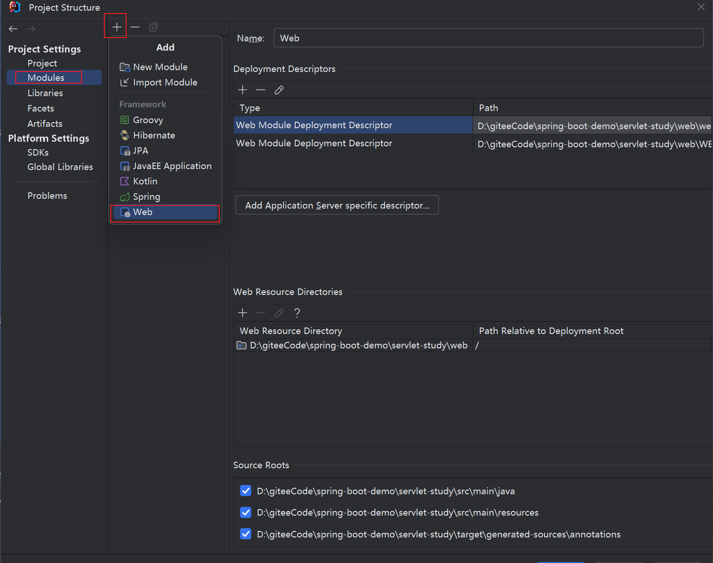
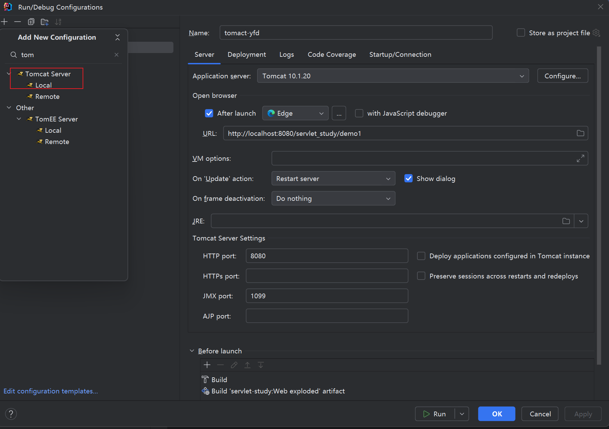
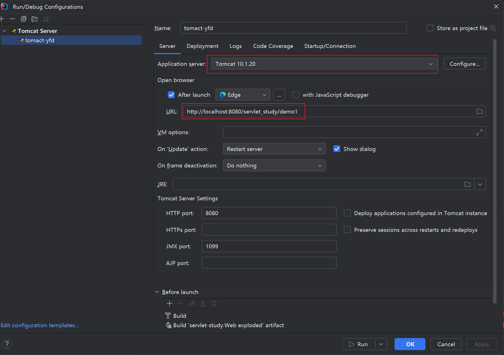
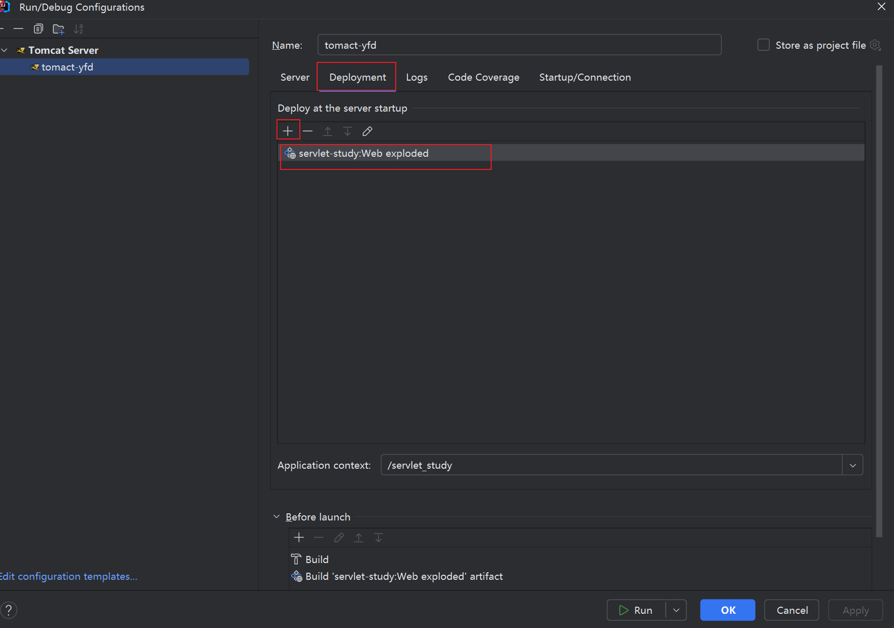

# servlet 概述
1. servlet 是一个接口
2. servlet 是一个规则是tomact发现并执行方的一个规则
# 准备工作
- idea 先创建一个java项目后，再按如下选择生成web.xml成为一个web项目 

- tomcat 下载tomact [tomact10](https://tomcat.apache.org/download-10.cgi),按如下顺序配置
  
  
  
# servlet 简单实现
1. jdk17 引入依赖
```xml

<dependencies>
    <dependency>
        <groupId>jakarta.servlet</groupId>
        <artifactId>jakarta.servlet-api</artifactId>
        <version>5.0.0</version>
    </dependency>
</dependencies>
```
2. 实现servlet 接口
```java
package com.yfd.servlet;


import jakarta.servlet.*;

import java.io.IOException;

public class ServletDemo implements Servlet {
    @Override
    public void init(ServletConfig servletConfig) throws ServletException {

    }

    @Override
    public ServletConfig getServletConfig() {
        return null;
    }

    @Override
    public void service(ServletRequest servletRequest, ServletResponse servletResponse) throws ServletException, IOException {
        System.out.println("hellow servlet");
    }

    @Override
    public String getServletInfo() {
        return "";
    }

    @Override
    public void destroy() {

    }
}

```
3. 配置web.xml
```xml
<?xml version="1.0" encoding="UTF-8"?>
<web-app xmlns="http://xmlns.jcp.org/xml/ns/javaee"
         xmlns:xsi="http://www.w3.org/2001/XMLSchema-instance"
         xsi:schemaLocation="http://xmlns.jcp.org/xml/ns/javaee http://xmlns.jcp.org/xml/ns/javaee/web-app_4_0.xsd"
         version="4.0">
    <servlet>
        <servlet-name>demo1</servlet-name>
        <servlet-class>com.yfd.servlet.ServletDemo</servlet-class>
    </servlet>
    <servlet-mapping>
        <servlet-name>demo1</servlet-name>
        <url-pattern>/demo1</url-pattern>
    </servlet-mapping>
</web-app>
```
4. 测试地址 http://localhost:8080/servlet_study/demo1
5. 执行原理
- 服务端收到请求后解析url
- 找到web.xml中对应的servlet
- url-pattern ->  servlet-name  -> servlet-class  存在则获取servlet的全路径名
- tomcat 会将字节码文件加载到内存，并通过反射创建对象
- 调用方法