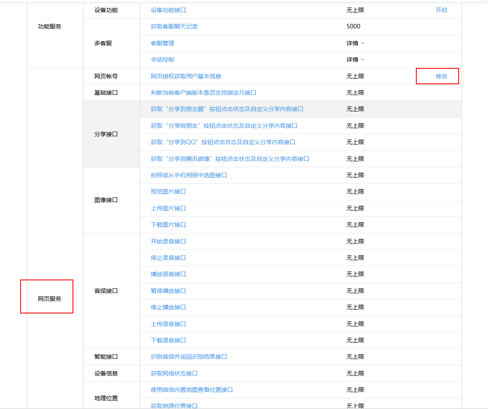
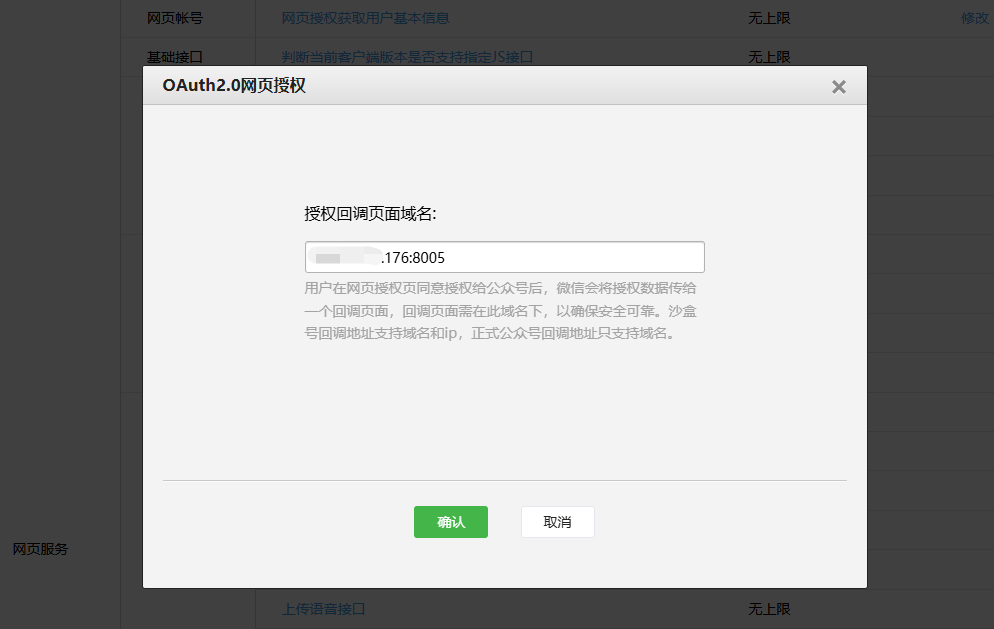
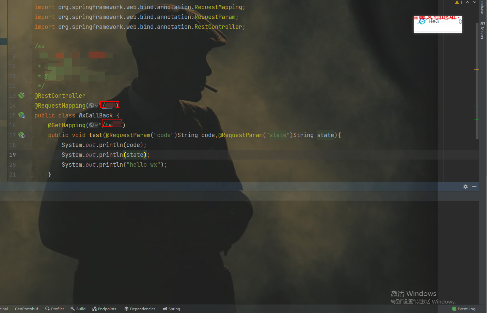

# 一、获取测试公众账号及相关配置
1. 微信官方文档地址：
`https://developers.weixin.qq.com/doc/offiaccount/Getting_Started/Overview.html`
2. 测试账号地址`
http://mp.weixin.qq.com/debug/cgi-bin/sandboxinfo?action=showinfo&t=sandbox/index
`
3. 进入页面修改这个oauth的回调配置

4. 写域名+端口就可以 

# 二、认证流程
1. 用户同意授权，获取code
`https://open.weixin.qq.com/connect/oauth2/authorize?appid=wx750c39f36cf3c82e&redirect_uri=http%3A%2F%2F59.110.44.176%3A8005%2Fwx%2Ftest&response_type=code&scope=snsapi_userinfo&state=123#wechat_redirect`
```text
https://open.weixin.qq.com/connect/oauth2/authorize?
//这个就是微信测试哪里的appid
appid=APPID
//回调参数是对应上边网页授权回调地址 需要保持一致区别在于配置网页授权回调时无需加HTTP
//在这里回调url需使用http开头并且经过 urlEncode 对链接进行处理
&redirect_uri=REDIRECT_URI
//这里获取code是固定参数
&response_type=code
//区分两种 
//snsapi_base （不弹出授权页面，直接跳转，只能获取用户openid），
//snsapi_userinfo （弹出授权页面，可通过openid拿到昵称、性别、所在地。
//并且， 即使在未关注的情况下，只要用户授权，也能获取其信息 ）
&scope=SCOPE 
//STATE是附带回来的参数看自己需要是否需要携带
&state=STATE#wechat_redirect 
```
通过回调地址拿到code

2. 通过code换取网页授权access_token
   `https://api.weixin.qq.com/sns/oauth2/access_token?appid=wx750c39f36cf3c82e&secret=7f9b4217a258aeab0074407418a22aa2&code=031OWoGa1wGWHH0CbwFa1gLEIi1OWoGF&grant_type=authorization_code`
```text
{
    "access_token": "1-_MdAtLHZrwLoxIlpaVwgrPAs-WfnYfXvZfn4UZ8u3QlsxFjcgTKOa8QRwVRdZyfdYiNj8R9k3viJMbkNfaqxF3fdGzku1A",
    "expires_in": 7200,
    "refresh_token": "1-uQN6hc6vNdC6QDkIT4qtjJlmFi7zLv7CCe6vCsaFQOpR_OHF_WzJEq5kmlIN2bEGOBtG6tciv7L0HAx0QaMr7O4v94o",
    "openid": "owhSH6pGChl0X_yREXk8hwvZHuOc",
    "scope": "snsapi_userinfo"
}
```