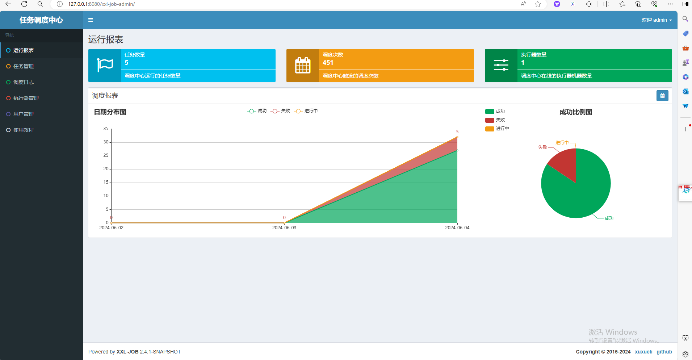

# 一、
## 下载

| 源码仓库地址 | Release Download                            |
|--------|---------------------------------------------|
| https://github.com/xuxueli/xxl-job   | https://github.com/xuxueli/xxl-job/releases |
|   http://gitee.com/xuxueli0323/xxl-job     | http://gitee.com/xuxueli0323/xxl-job/releases                                            |
## 概念
任务调度中心: 将调度行为抽象形成“调度中心”公共平台，而平台自身并不承担业务逻辑，“调度中心”负责发起调度请求。

任务执行器: 将任务抽象成分散的JobHandler，交由“执行器”统一管理，“执行器”负责接收调度请求并执行对应的JobHandler中业务逻辑。

任务：具体的定时任务在各自服务的模块中实现具体的逻辑

xxl-job 在项目中主要的功能就是处理定时任务
# 二、

任务调度中心：

- 调度中心配置地址
```text
xxl-job-admin/src/main/resources/application.properties
```
- 配置文件 只修改了数据库链接配置
```properties
### web
server.port=8080
server.servlet.context-path=/xxl-job-admin

### actuator
management.server.servlet.context-path=/actuator
management.health.mail.enabled=false

### resources
spring.mvc.servlet.load-on-startup=0
spring.mvc.static-path-pattern=/static/**
spring.resources.static-locations=classpath:/static/

### freemarker
spring.freemarker.templateLoaderPath=classpath:/templates/
spring.freemarker.suffix=.ftl
spring.freemarker.charset=UTF-8
spring.freemarker.request-context-attribute=request
spring.freemarker.settings.number_format=0.##########

### mybatis
mybatis.mapper-locations=classpath:/mybatis-mapper/*Mapper.xml
#mybatis.type-aliases-package=com.xxl.job.admin.core.model

### xxl-job, datasource  配置文件 只修改了数据库链接配置
spring.datasource.url=jdbc:mysql://127.0.0.1:3306/xxl_job?useUnicode=true&characterEncoding=UTF-8&autoReconnect=true&serverTimezone=Asia/Shanghai
spring.datasource.username=root
spring.datasource.password=123456
spring.datasource.driver-class-name=com.mysql.cj.jdbc.Driver

### datasource-pool
spring.datasource.type=com.zaxxer.hikari.HikariDataSource
spring.datasource.hikari.minimum-idle=10
spring.datasource.hikari.maximum-pool-size=30
spring.datasource.hikari.auto-commit=true
spring.datasource.hikari.idle-timeout=30000
spring.datasource.hikari.pool-name=HikariCP
spring.datasource.hikari.max-lifetime=900000
spring.datasource.hikari.connection-timeout=10000
spring.datasource.hikari.connection-test-query=SELECT 1
spring.datasource.hikari.validation-timeout=1000

### xxl-job, email
spring.mail.host=smtp.qq.com
spring.mail.port=25
spring.mail.username=xxx@qq.com
spring.mail.from=xxx@qq.com
spring.mail.password=xxx
spring.mail.properties.mail.smtp.auth=true
spring.mail.properties.mail.smtp.starttls.enable=true
spring.mail.properties.mail.smtp.starttls.required=true
spring.mail.properties.mail.smtp.socketFactory.class=javax.net.ssl.SSLSocketFactory

### xxl-job, access token
xxl.job.accessToken=default_token

### xxl-job, i18n (default is zh_CN, and you can choose "zh_CN", "zh_TC" and "en")
xxl.job.i18n=zh_CN

## xxl-job, triggerpool max size
xxl.job.triggerpool.fast.max=200
xxl.job.triggerpool.slow.max=100

### xxl-job, log retention days
xxl.job.logretentiondays=30
```

- 运行xxl-job-admin项目，启动成功访问 [xxl-job-admin](http://localhost:8080/xxl-job-admin)

  默认登录账号 “admin/123456”
  

- 配置任务执行器


XXL-JOB的阻塞处理策略是指当执行器节点存在多个相同任务id的任务未执行完成时，调度中心如何对任务进行取舍的策略1。XXL-JOB提供了三种阻塞处理策略234：
单机串行：默认策略，任务依次排队执行。
丢弃后续调度：当上一个任务没有执行完，当前这个任务不会执行。
覆盖之前调度：当前这个任务会覆盖上一个任务。