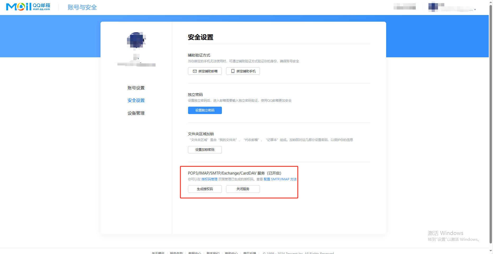

## 配置邮箱
1. 配置qq邮箱

2. xxl-job-admin 中配置文件中配置邮箱
```yaml
### xxl-job, email
spring.mail.host=smtp.qq.com
spring.mail.port=25
spring.mail.username=xxxxxxxx3514@qq.com
spring.mail.from=xxxxxxxx3514@qq.com
spring.mail.password=xxxxxxxx
spring.mail.properties.mail.smtp.auth=true
spring.mail.properties.mail.smtp.starttls.enable=true
spring.mail.properties.mail.smtp.starttls.required=true
spring.mail.properties.mail.smtp.socketFactory.class=javax.net.ssl.SSLSocketFactory
```
## 存在的问题
